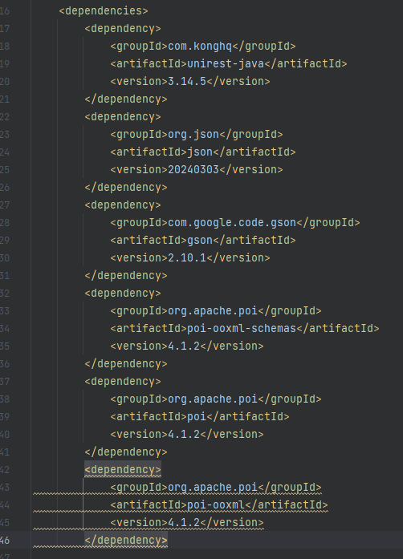
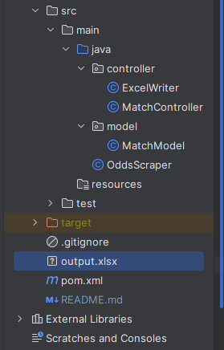
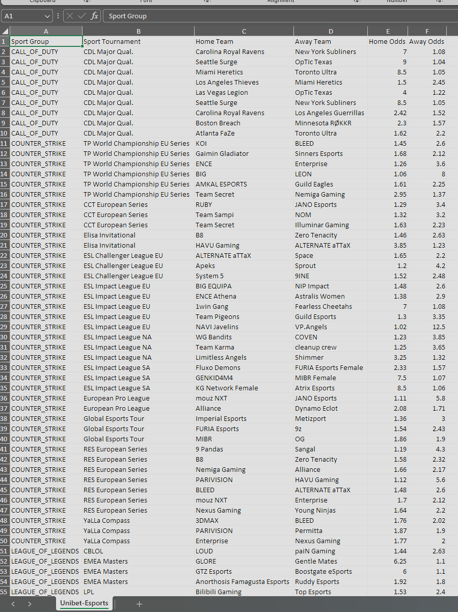

# E-Sports odds scraping from Unibet website

This project will gather the match odds for all prematch e-sports events that are available to place bets on Unibet website. Odds are then exported with a decimal format in an excel file.

## Table of Contents

- [Installation](#installation)
- [Usage](#usage)

## Installation

1. Clone the repository.
2. If you are missing any dependency, under pom.xml add the following dependencies and rebuild the project:

## Usage

The use of this project is fairly straight forward. You can just run the program and an excel file called "output.xlsx" will be created.

We can open this excel file and see all available e-sports odds on Unibet site with the decimal format.

